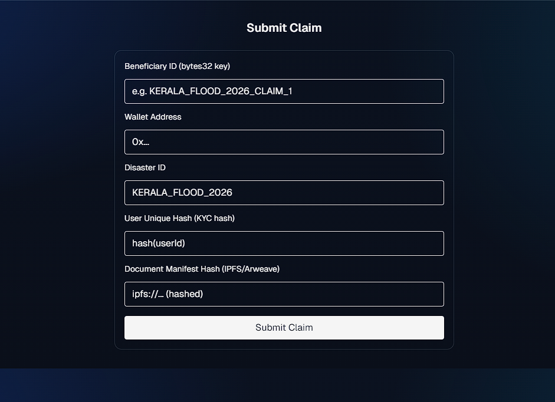

# MonadRelief (Mon-Aid)

A real-time micro-donation platform for disaster relief built on Monad L1.

## Repos
- `blockchain/`: Hardhat workspace with `MonadRelief` smart contract
- `backend/`: TypeScript Express API + WebSocket for live stats
- `frontend/`: Next.js + Tailwind UI
- `docs/blueprint.md`: Architecture blueprint and case study

## What is Mon-Aid?
Mon-Aid is a real-time disaster-relief donation platform built on the Monad blockchain. It enables micro-donations from $0.01 with under-1s finality, routing funds only to wallets verified by a government SBT registry and a community jury. Donations and disbursements are fully on-chain and transparent.

### Why Monad
- Parallel execution handles crisis surges (10k+ TPS)
- Ultra-low fees make penny donations viable
- Instant finality means victims can use funds immediately
- Immutable transparency builds trust

### Pitch (Story)
In 2022, when floods devastated parts of Assam in Northeast India, entire villages were submerged. Families were trapped on rooftops, relief camps overflowed, and clean water was almost impossible to find.

I remember a story of Rina, a mother of two, who waited three days with her children before she could even get a packet of dry food. Donors around the world pledged millions, but the money took weeks to filter through agencies and reach the ground. For Rina, those first 72 hours were the difference between survival and despair.

This is what Mon-Aid changes.

- People anywhere can send $1 or even $0.01 instantly during a disaster.
- On the Monad blockchain, funds arrive in under a second — directly into verified relief wallets.
- Victims can use donations immediately for clean water, food packets, medicines, or temporary shelter.
- Transparent, on-chain tracking shows exactly where every cent goes.

With Mon-Aid, global compassion isn’t slowed down by paperwork or delays — it becomes a real-time lifeline. Because when disaster strikes, help delayed is help denied.

### UI Concepts
Primary concepts first, followed by additional views (all in `/frontend/public`):
- `ui1.png`, `ui5.png`
- `ui2.png`, `ui3.png`, `ui4.png`

Open the in-app page `/pitch` to view embedded concepts.

#### Screenshots

Primary concepts:


Additional views:





## Prereqs
- Node.js 18+
- pnpm/yarn/npm
- A Monad-compatible RPC (configure `MONAD_RPC`), or local EVM RPC for dev

## Setup

### 1) Blockchain
```bash
cd blockchain
npm install
npm run build
# start a local node if needed (e.g. anvil/hardhat node) and set MONAD_RPC
npm run deploy
```
On Monad testnet, deployed addresses:
- GovernmentRegistry: `0x7154b061045a03b9fF86C83c606c64afC790791b`
- JuryStaking: `0xf91DCe7082D1721563C69b56b82d051bC55A332b`
- BeneficiaryRegistry: `0xDb22ba96790144c5dE4FAfb06690d73BB6B551d1`
- MonadReliefV2 (native): `0xa6FfdFaB1134E7B5C2864732576AfA3b4320a47d`
- MockUSD (test token): `0x7C57F3DdcDF82C97eBE70c4f4FDf2Bc6Ea910629`
- MonadReliefERC20 (stablecoin path): `0x1AD44BAa0897D0C22CCb20098477D635FAb271d7`

Use `MonadReliefV2` for `RELIEF_CONTRACT_ADDRESS` and `BeneficiaryRegistry` for `BENEFICIARY_REGISTRY_ADDRESS` in the backend.

### 2) Backend
```bash
cd backend
npm install
# Create environment
# PORT=4000
# MONAD_RPC=http://127.0.0.1:8545
# RELIEF_CONTRACT_ADDRESS=0xYourDeployedContract
# DEPLOYER_KEY=0xYourKeyIfNeeded
npm run dev
```
- REST: `GET /api/stats`
- WS: `ws://localhost:4000/ws` (broadcast live stats)

### 3) Frontend
```bash
cd frontend
npm install
# Set NEXT_PUBLIC_BACKEND_URL=http://localhost:4000 (via env or shell)
npm run dev
```
Open `http://localhost:3000`. Use the donation form and view live stats.

## Notes
- The MVP contract accepts native donations and instantly forwards to verified beneficiaries for transparent, on-chain disbursement.
- Add ERC20 stablecoin flows and FX guardrails as a next step.
- See `docs/blueprint.md` for governance, scaling, and case study details.


